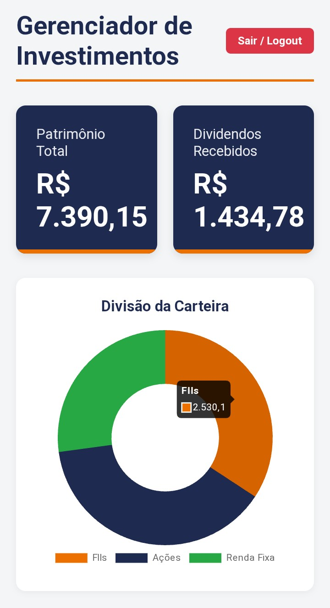
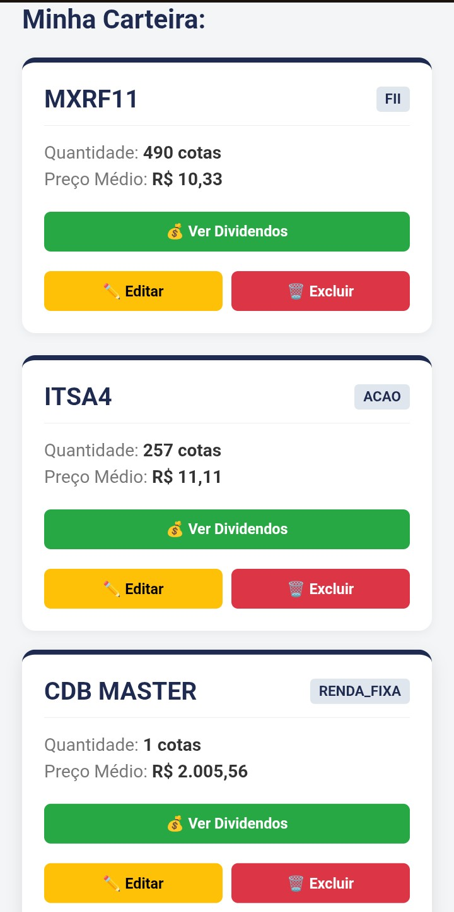
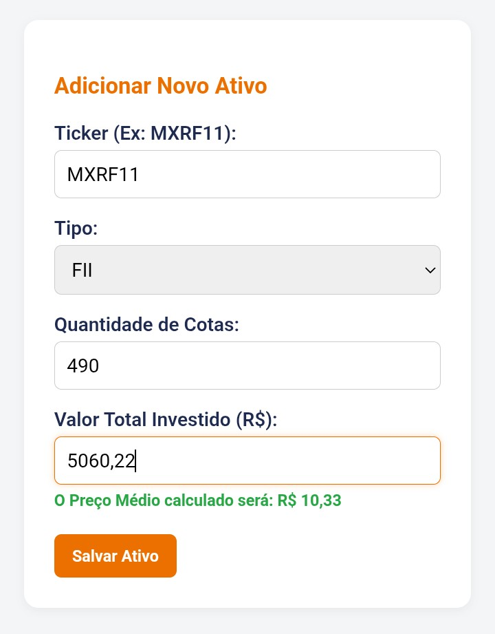
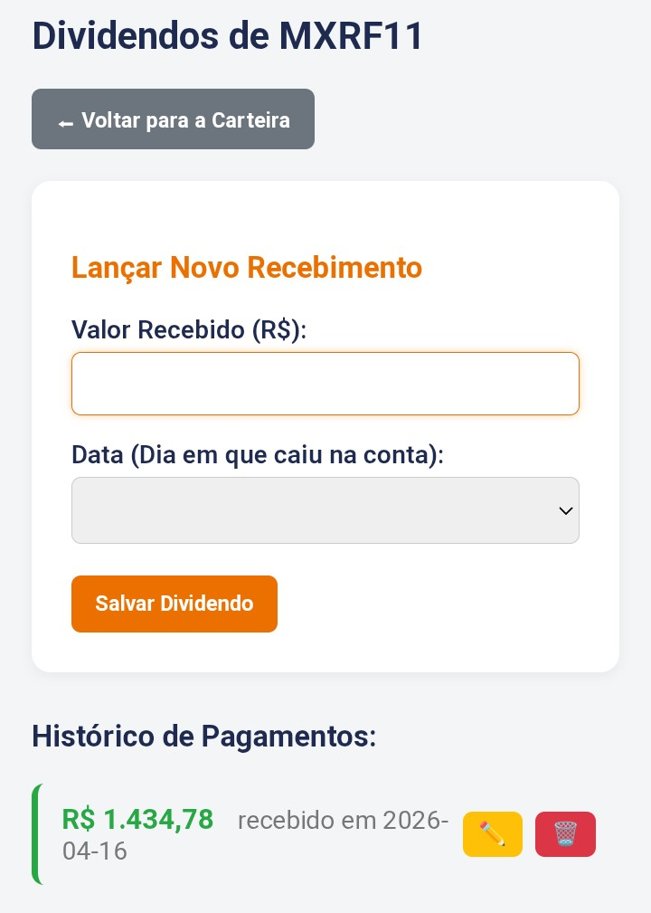

# 📊 Gerenciador de Investimentos (FIIs, Ações e Renda Fixa)

Aplicação Full-Stack desenvolvida para o gerenciamento de carteiras de investimentos. O sistema permite o controle detalhado de ativos (Fundos Imobiliários, Ações e Renda Fixa), cálculo automático de preço médio, acompanhamento de dividendos e visualização do patrimônio através de gráficos dinâmicos.

🚀 **Acesse o projeto rodando ao vivo:** [CLIQUE AQUI PARA TESTAR](https://gerenciador-fii.vercel.app/)
> **Nota de Infraestrutura:** O backend está hospedado em um serviço gratuito (Render). O primeiro acesso pode levar cerca de 50 segundos para "acordar" o servidor. As requisições seguintes ocorrem em tempo real.

## 🛠️ Tecnologias Utilizadas

O projeto foi construído separando completamente as responsabilidades entre Frontend e Backend, consumindo uma API RESTful.

**Frontend:**
* **Angular 17+** (Framework SPA)
* **TypeScript**
* **Chart.js** (Renderização de gráficos)
* **HTML5 & CSS3** (Interface responsiva)
* **Vercel** (Deploy contínuo / Hospedagem)

**Backend:**
* **Java 21**
* **Spring Boot 3** (Web, Data JPA, Security)
* **Hibernate** (Mapeamento Objeto-Relacional)
* **PostgreSQL** (Banco de Dados Relacional)
* **Neon.tech** (Hospedagem do Banco de Dados em Nuvem)
* **Render & Docker** (Deploy da API)

---

## ⚙️ Funcionalidades Principais

Abaixo, apresentamos as principais funcionalidades do sistema com imagens demonstrativas extraídas diretamente da interface móvel.

### 📈 1. Dashboard Visual e Indicadores Principais

Ao logar, o usuário é recebido por um painel centralizado que fornece uma visão geral do seu patrimônio.

- **Indicadores de Resumo:** Visualização instantânea do Patrimônio Total e do Total de Dividendos Recebidos.
- **Gráfico Interativo:** Um gráfico de rosca dinâmico mostra a alocação percentual da carteira por classe de ativo (FIIs, Ações e Renda Fixa). É possível interagir para ver os valores absolutos.

<figure align="center">
  
  <figcaption>Painel de controle com resumo patrimonial e gráfico de alocação de ativos.</figcaption>
</figure>

---

### 🛠️ 2. Gerenciamento Completo de Ativos (CRUD)

Esta funcionalidade permite ao usuário construir e gerenciar sua carteira de forma intuitiva.

- **Listagem da Carteira:** Visualização clara de todos os ativos cadastrados, organizados em cards informativos que mostram o ticker, tipo, quantidade e preço médio.
- **Adicionar, Editar e Excluir:** Formulários dedicados para cada ação, permitindo o controle total sobre os registros.

<figure align="center">
  
  <figcaption>Card principal mostrando a listagem de todos os ativos da carteira.</figcaption>
</figure>

<figure align="center">
  
  <figcaption>Formulário para cadastro de novos ativos, demonstrando a interação e cálculos.</figcaption>
</figure>

- **Cálculos Automáticos:** O sistema calcula o preço médio de forma automática com base no valor total investido e a quantidade de cotas informadas.

---

### 💰 3. Gestão de Dividendos e Histórico

Esta funcionalidade é essencial para o acompanhamento da renda passiva.

- **Lançamento de Dividendos:** Lançamentos dedicados de rendimentos atrelados a ativos específicos da carteira.
- **Histórico de Pagamentos:** Uma lista detalhada dos dividendos recebidos, organizada cronologicamente para o ativo selecionado.
- **Ações de Edição e Exclusão:** Controle sobre o histórico de pagamentos.

<figure align="center">
  
  <figcaption>Visualização dos dividendos de um ativo específico, com formulário de lançamento e histórico.</figcaption>
</figure>

---

## 👨‍💻 Autor

**Kaique Santos** 📍 São Paulo, Brasil
Estudante de Análise e Desenvolvimento de Sistemas
* [LinkedIn](https://www.linkedin.com/in/kaiquehsfs/).